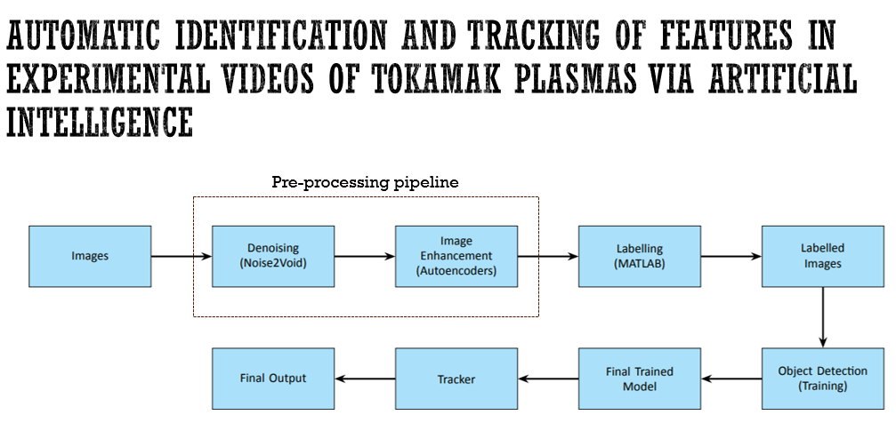

# Master Thesis Project -  Harshit Sethi





## About

The repository consists of the pre-processing steps required to effectively detect the features in the experimental videos of Tokamak plasma. 
The following model/architecture are used for pre-processing - 
- Autoencoders are used in the pre-processing pipeline as an image enhancer 
- Noise2void is an self-supervised model to denoise the images 


For the detection, YOLO is used. 

## Table of Contents
- [Installation](#installation)
- [How to use](#usage)
- [Utility Scripts](#arguments)

## Installation


0. (Optional) Create and activate new environment using [`conda`](https://conda.io/projects/conda/en/latest/user-guide/getting-started.html) or `venv` ([`+pyenv`](https://github.com/pyenv/pyenv)).

   a. `conda` version:

   ```bash
   # create env
   conda create -n project_env python=PYTHON_VERSION

   # activate env
   conda activate project_env
   ```

   b. `venv` (`+pyenv`) version:

   ```bash
   # create env
   ~/.pyenv/versions/PYTHON_VERSION/bin/python3 -m venv project_env

   # alternatively, using default python version (for linux user)
   python -m venv project_env

   # activate env
   source project_env
   ```

1. Install all required packages

   ```bash
   pip install -r requirements.txt
   ```
***Note*** - Make sure cuda (preferably cuda 11.8) is already installed. 

## How to Use

## Python Scripts for pre-processing

### [n2v_filtering.py](n2v_filtering.py) 
The script is used for applying denoising to video frames using a pre-trained Noise2Void (N2V) model.  The script reads video frames from an HDF5 file, applies denoising to each frame, and saves the filtered frames to a new HDF5 file.

**To use the script**, run it from the terminal with the necessary arguments:
```bash
   python n2v_filtering.py <baseDir> <name> <dataPath> <output>
   ```

##### Arguments
- baseDir: The directory where the pre-trained N2V modelss is stored.
- name: The name of the pre-trained N2V model.
- dataPath: The path to the input HDF5 file containing the video frames.
- output: The path where the output HDF5 file with denoised frames will be saved.

The trained model's weight can be found [here](models\n2v_trained_model_1\weights_best.h5). 


### [autoencoder_inference.py](autoencoder_inference.py) 
The script is for performing video frame processing using an autoencoder model. The script reads video data from an HDF5 file, processes each frame using a trained autoencoder, and saves the processed video frames back to an HDF5 file.

**To use the script**, run it from the terminal with the necessary arguments:
```bash
   python autoencoder_inference.py <channels> <layers> <autoencoder_weights_path> <input_file_path> <output_file_path> <device> <tif_dir>
   ```
##### Arguments
- channels: The number of channels for the autoencoder architecture.
- layers: The number of layers in the autoencoder.
- autoencoder_weights_path: The path to the weights of the trained autoencoder model.
- input_file_path: The path to the HDF5 file containing the video to be processed.
- output_file_path: The path to which the processed data will be saved.
- device (optional argument): : The device to be used for inference. Options are cpu or cuda. The default value is cpu.
- tif_dir (optional argument):he directory where processed frames will be saved as TIFF files. If this argument is provided, the script will save each frame as a TIFF file in the specified directory. If not provided, no TIFF files will be saved.

The trained models' weights are saved [here](results_autoencoder/).
The most optimal model was found to be autoencoder_3l_128c. 

## Training via Jupyter Notebooks 

[train_noise2void_notebook.ipynb](train_noise2void_notebook.ipynb) - The jupyter notebook is used for training noise2void model 

[train_autoencoder_notebook.ipynb](train_autoencoder_notebook.ipynb) - This jupyter notebook is used for training autoencoders. It can be adapted to tune hyperparameters and see the performance.


## Utility scripts 
[autoencoder.py](autoencoder.py) - The following script contains the general architecture of Autoencoders which can be made specific by choosing the number of layers and channels. The model can be loaded from this script using - 

```bash
   # Importing Autoencoder
   from autoencoder import Autoencoder

   # Initialize model
   model = Autoencoder(c=channels, layer=layer)
   ```


[saveYOLOLabels.m](saveYOLOLabels.m) - The following script is written in matlab. It is used to convert the labels generated by MATLAB to YOLO compatibile configuration labels. To use this, run it on matlab - 
```bash
matlab <matFilePath> <outputDir> <saveBothClasses>
```
Args: 
matFilePath - The path of the .mat file that contains the labels
outputDir - The output path of the folder where to save the label
saveBothClasses(optional) - If true, saves both dark and bright islands labels. If false(default), saves only dark islands class labels - which is the main interest in our work. 


## YOLO Model 
## Data Preprocessing
To train a YOLO model, your data must be organized in a specific structure:

```bash
dataset/
│
├── images/
│   ├── train/
│   └── val/
│        ├── {pulse_number}_img_{frame_number}.png
│
└── labels/
    ├── train/
    └── val/
         └── {pulse_number}_img_{frame_number}.txt
```

- images/: Contains the images for training and validation.
   - train/: Folder for training images.
   - val/: Folder for validation images.
- labels/: Contains the corresponding label files for training and validation.
   - train/: Folder for training labels.
   - val/: Folder for validation labels.

### [yolo_data_processing.py](yolo_data_processing.py) 
The given script can convert your data into the required format as stated above. For this, the we require input image directory and input label directory to structed as given below. 

```bash
dataset/
│
├── images/
│   ├── Segmented Images_{pulse_number}/
│   ├── Segmented Images_{pulse_number}
│        ├── {pulse_number}_img_{frame_number}.tif
│
└── labels/
    ├── {pulse_number}_labels
         └── {pulse_number}_img_{frame_number}.txt
```

This script transforms your data directory to match the YOLO model’s requirements (training and validation directory split) for training the model. 

**To use the script** - 


```bash
python <yolo_data_processing.py> <input_labels_dir> <input_image_dir> <yolo_data_dir> <train_ratio>
```

Args:

- input_labels_dir: Path to the directory containing the label files.
- input_image_dir: Path to the directory containing the image files.
- yolo_data_dir: Path to the directory where the YOLO-formatted data will be saved.
- train_ratio: Ratio of images to be used for training (e.g., 0.75 for 75% training and 25% validation).


## YOLO Configuration file 
The [yolo_config.yml](yolo_config.yml) file is essential for training YOLO models. It defines the class names and specifies the paths for training and validation datasets. In this configuration, only one class, dark_islands, is considered.
```bash
names:
  '0': 'dark_islands'
path: /kaggle/working/yolo
train: images/train
val: images/val
```

## Training 
### [yolo_train.py](yolo_train.py) - Script to train the yolo model for the given dataset


```bash
python script.py path/to/config.yml yolov10x 50 your_wandb_api_key your_project_name your_run_name
```
Args: 

- path/to/config.yml: Replace with the path to your YAML configuration file.
- yolov10x: Replace with the desired YOLO model name.
- 50: Replace with the number of epochs you want to train for.
- your_wandb_api_key: Replace with your Wandb API key.
- your_project_name: Replace with the name of your Wandb project.
- your_run_name: Replace with a name for this specific run.


### Hyperparameter Optimization 
### [yolo_hyperparameter_optimization.py](yolo_hyperparameter_optimization.py)
Instead of manually finding the best hyperparameters, we can use Ray tune library integrated in Ultralytics for hyperparameter optimization. [Genetic algorithm](https://docs.ultralytics.com/guides/hyperparameter-tuning/#repeat) is used for optimization. 
This can be achieved with [yolo_hyperparameter_optimization.py](yolo_hyperparameter_optimization.py) script. **To use** - 

```bash 
python script.py path/to/config.yml yolov10x 50 10
```

Args: 

- path/to/config.yml: Replace with the path to your YAML configuration file.
- yolov10x: Replace with the YOLO model name you wish to use.
- 50: Number of epochs to train for.
- 10: Number of iterations for hyperparameter tuning.

## Inference (Object detection and tracking) 
### YOLO inference script

[yolo_inference.py](yolo_inference.py) utilizes the YOLO (You Only Look Once) model from the Ultralytics library to perform object detection and tracking on video frames stored in an HDF5 (.h5) file. It processes the video frames, extracts bounding boxes, confidence scores, and class IDs, and saves this tracking data into a new .h5 file.

Usage:
```bash
    python process_video.py <model_path> <video_path> <output_path> <device>
```

Arguments:
    - model_path (str): Path to the trained YOLO model (e.g., 'yolov8.pt').
    - video_path (str): Path to the .h5 file containing video frames with the dataset named 'frame_data'.
    - output_path (str): Path to save the output .h5 file containing tracking data.
    - device (str): Device to be used for processing, either 'cpu' or 'cuda'.

The optimized YOLOv10m model's weight can be found [here](results_yolo_optimized\weights).

The generated output `.h5` file contains the following datasets:

- **frame_data**: Video frames extracted from the input file.
  - Shape: `(num_frames, height, width)`

- **time**: Timestamps corresponding to each frame.
  - Shape: `(num_frames,)`

- **track_boxes_<timestamp>**: Bounding boxes for detected objects at the given timestamp.
  - Shape: `(num_detections, 4)` (columns: `x_center, y_center, width, height`)

- **track_confidences_<timestamp>**: Confidence scores for detections at the given timestamp.
  - Shape: `(num_detections,)`

- **track_classes_<timestamp>**: Class IDs for detected objects at the given timestamp.
  - Shape: `(num_detections,)`

